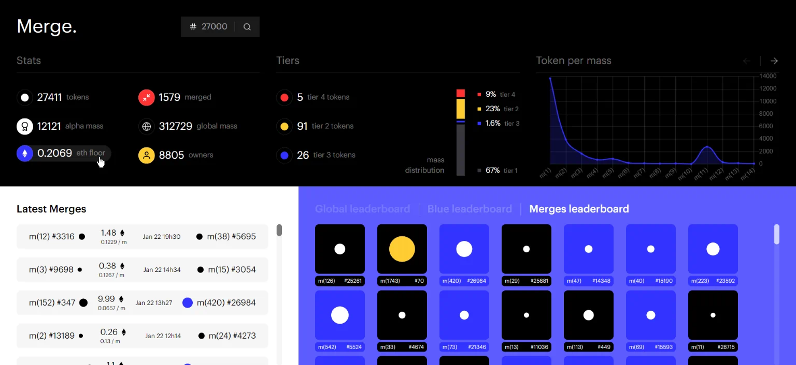

<p align="center">
    
</p>

# Live

### 🔗 ***[merge.tina.cafe](https://merge.tina.cafe/)***
Served using *[Yeetify 💨](https://github.com/tinawng/yeetify)*


# Intro
Another data presentation website with a more "statistics dashboard" approach.


# Stack

### Nuxt.js
- ⚡️ Static website generation
### Tailwind
- 💄 Responsive design
- 🎨 PurgeCSS

# Links

- 🏗️ Nuxt.js: *[https://nuxtjs.org](https://nuxtjs.org/)*
- ✨ Vue.js: *[https://vuejs.org](https://vuejs.org/)*
- 💄 Tailwind CSS: *[https://tailwindcss.com](https://tailwindcss.com/)*

# Build Process

```bash
# install dependencies
$ yarn install

# dev server with hot reload
$ yarn run dev

# build for production
$ yarn run generate
```